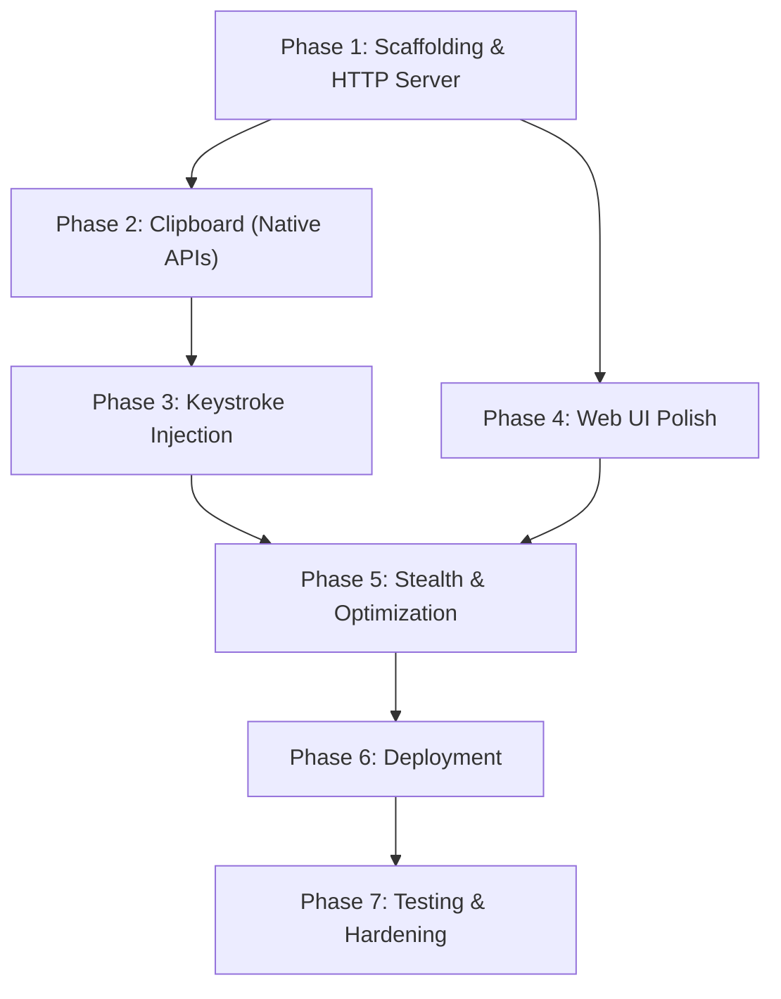

# Development Plan: Pasta

> A stealthy background daemon for remote text paste via a local web interface.

## Project Summary

| Field | Value |
|---|---|
| Language | Go 1.21+ |
| Target OS | Linux (X11/Wayland) & Windows 10/11 |
| Binary Name | `pasta` / `pasta.exe` |
| Key Constraint | Zero subprocess spawning — all OS interaction via native APIs |

---

## Phase 1: Project Scaffolding & Core HTTP Server

**Goal:** Establish the Go module, directory structure, and a working embedded web server.

### 1.1 Initialize Go Module & Directory Layout

```
pasta/
├── main.go                  # Entrypoint, flag parsing, server startup
├── go.mod
├── go.sum
├── web/                     # Embedded static assets
│   ├── index.html
│   ├── style.css
│   └── app.js
├── server/
│   └── server.go            # HTTP handler registration, /api/sync handler
├── clipboard/
│   ├── clipboard.go         # Interface definition
│   ├── clipboard_linux.go   # Linux (X11/Wayland CGO) implementation
│   └── clipboard_windows.go # Windows (user32.dll syscall) implementation
├── injector/
│   ├── injector.go          # Interface definition
│   ├── injector_linux.go    # Linux (/dev/uinput) implementation
│   └── injector_windows.go  # Windows (SendInput) implementation
├── deploy/
│   ├── pasta.service        # Systemd user unit file
│   └── install.ps1          # Windows install script (Task Scheduler / Run key)
├── Makefile                 # Cross-compilation & stripped build targets
└── README.md
```

### 1.2 Tasks

| # | Task | Detail |
|---|---|---|
| 1 | `go mod init` | Initialize `github.com/<user>/pasta` (or local module path) |
| 2 | Create `web/` assets | Minimal mobile-first HTML page with text area + "Send" button |
| 3 | Embed assets | Use `//go:embed web/*` in a dedicated embed package or `main.go` |
| 4 | `GET /` handler | Serve `index.html` from the embedded filesystem |
| 5 | `POST /api/sync` handler | Parse `{"text": "..."}` JSON body, validate, return stub `{"success": true}` |
| 6 | Startup flags | `--port` flag (default `:8765`) for the listen address |
| 7 | Verify | `go run .` → open browser → confirm UI loads and POST returns stub response |

### Deliverable
A single self-contained binary that serves the web UI and accepts paste requests (without yet writing to the clipboard).

---

## Phase 2: Clipboard Management (Native APIs)

**Goal:** Implement the clipboard interface for both Linux and Windows — **no subprocess spawning**.

### 2.1 Define Interface

```go
// clipboard/clipboard.go
package clipboard

type Clipboard interface {
    SetText(text string) error
}
```

### 2.2 Linux Implementation (`clipboard_linux.go`)

| # | Task | Detail |
|---|---|---|
| 1 | CGO + X11 | Use `#cgo pkg-config: x11` and call `XSetSelectionOwner` / `XChangeProperty` to own the `CLIPBOARD` selection |
| 2 | Wayland fallback | Use `wl_data_source` via CGO bindings to `libwayland-client` if `$WAYLAND_DISPLAY` is set |
| 3 | Selection event loop | Run a goroutine to service `SelectionRequest` events so other apps can read the clipboard |
| 4 | Build tag | File guarded by `//go:build linux` |

### 2.3 Windows Implementation (`clipboard_windows.go`)

| # | Task | Detail |
|---|---|---|
| 1 | `user32.dll` syscalls | `OpenClipboard`, `EmptyClipboard`, `SetClipboardData`, `CloseClipboard` via `golang.org/x/sys/windows` or raw `syscall.NewLazyDLL` |
| 2 | `CF_UNICODETEXT` | Allocate global memory (`GlobalAlloc`), copy UTF-16 encoded text, set format `CF_UNICODETEXT` (13) |
| 3 | Thread affinity | Clipboard calls must run on the same OS thread — use `runtime.LockOSThread()` |
| 4 | Build tag | File guarded by `//go:build windows` |

### 2.4 Wire into `/api/sync`

- Instantiate the platform-specific `Clipboard` at startup
- Call `clipboard.SetText(payload.Text)` inside the POST handler

### Deliverable
Text sent from the web UI appears in the host's system clipboard. Verifiable via `Ctrl+V` manually.

---

## Phase 3: Keystroke Injection (Auto-Paste)

**Goal:** After setting the clipboard, simulate `Ctrl+V` in the active window — **zero subprocesses**.

### 3.1 Define Interface

```go
// injector/injector.go
package injector

type Injector interface {
    Paste() error
}
```

### 3.2 Linux Implementation (`injector_linux.go`) — `/dev/uinput`

| # | Task | Detail |
|---|---|---|
| 1 | Open `/dev/uinput` | `os.OpenFile("/dev/uinput", os.O_WRONLY, 0)` |
| 2 | Configure virtual device | `ioctl` calls: `UI_SET_EVBIT` (EV_KEY), `UI_SET_KEYBIT` (KEY_LEFTCTRL, KEY_V), `UI_DEV_CREATE` |
| 3 | Emit keystroke | Write `input_event` structs: press Ctrl → press V → release V → release Ctrl, with `EV_SYN` after each pair |
| 4 | Cleanup | `UI_DEV_DESTROY` on shutdown |
| 5 | Permission check | At startup, verify `/dev/uinput` is writable; log helpful error if user is not in `input` group |

### 3.3 Windows Implementation (`injector_windows.go`) — `SendInput`

| # | Task | Detail |
|---|---|---|
| 1 | `user32.dll` → `SendInput` | Build an `INPUT` array with `KEYBDINPUT` structs |
| 2 | Simulate `Ctrl+V` | 4 inputs: Ctrl down, V down, V up, Ctrl up (using virtual key codes `VK_CONTROL`, `0x56`) |
| 3 | UIPI awareness | Note: `SendInput` may fail if the foreground window is elevated (Admin) and the daemon is not. Document this limitation. |

### 3.4 Wire into `/api/sync`

- After `clipboard.SetText()` succeeds, add a small delay (`time.Sleep(50 * time.Millisecond)`) for clipboard propagation, then call `injector.Paste()`

### Deliverable
Full end-to-end flow: send text from phone → text appears at the cursor in the active window on the host.

---

## Phase 4: Web UI Polish

**Goal:** Build a clean, mobile-first interface optimized for quick one-handed paste operations.

| # | Task | Detail |
|---|---|---|
| 1 | Mobile viewport | `<meta name="viewport" content="width=device-width, initial-scale=1">` |
| 2 | Dark theme | Minimal CSS — dark background, readable text area, large "Send" button |
| 3 | Feedback | Show success/error toast on POST response |
| 4 | Auto-focus | Focus the text area on page load |
| 5 | Clear on success | Clear text area after successful send |
| 6 | Connection status | Small indicator showing whether the host is reachable |
| 7 | Keyboard shortcut | `Ctrl+Enter` to send |

### Deliverable
A polished, thumb-friendly web UI embedded in the binary.

---

## Phase 5: Stealth & Resource Optimization

**Goal:** Ensure the daemon is invisible to system monitors and consumes near-zero resources.

| # | Task | Detail |
|---|---|---|
| 1 | Stripped binary | `go build -ldflags="-s -w"` — strips debug symbols and DWARF info |
| 2 | Windows GUI mode | `go build -ldflags="-s -w -H=windowsgui"` — no console window |
| 3 | Idle CPU verification | Profile with `pprof` — confirm 0% CPU when idle (no goroutine polling) |
| 4 | Memory verification | Confirm idle RSS < 15MB |
| 5 | No logging to disk | Default: no log files. Optional `--verbose` flag for debugging only |
| 6 | EcoQoS awareness (Windows) | If latency issues arise, call `SetProcessInformation` with `ProcessPowerThrottling` to opt out of Efficiency Mode |
| 7 | Graceful shutdown | Handle `SIGTERM`/`SIGINT` (Linux) and console close events (Windows) to clean up uinput devices |

### Deliverable
A binary that passes stealth criteria: < 15MB RSS, 0% idle CPU, no child processes, no visible windows.

---

## Phase 6: Deployment & Distribution

**Goal:** Provide simple, one-command install paths for both platforms.

### 6.1 Linux

| # | Task | Detail |
|---|---|---|
| 1 | Systemd unit | Ship `deploy/pasta.service` with `DISPLAY` and `WAYLAND_DISPLAY` env vars |
| 2 | Install script | Shell script: copy binary to `~/.local/bin/`, install + enable systemd user service |
| 3 | `input` group check | Script warns if user is not in `input` group |

### 6.2 Windows

| # | Task | Detail |
|---|---|---|
| 1 | Registry Run key | PowerShell script to add `HKCU\Software\Microsoft\Windows\CurrentVersion\Run\Pasta` |
| 2 | Alternative: Task Scheduler | XML task definition for "At log on" trigger |
| 3 | Installer optional | Consider a simple `.msi` or self-extracting archive for non-technical users |

### 6.3 Build Targets (Makefile)

```makefile
build-linux:
	CGO_ENABLED=1 GOOS=linux GOARCH=amd64 go build -ldflags="-s -w" -o bin/pasta .

build-windows:
	CGO_ENABLED=0 GOOS=windows GOARCH=amd64 go build -ldflags="-s -w -H=windowsgui" -o bin/pasta.exe .
```

### Deliverable
Ready-to-distribute binaries with install scripts for both platforms.

---

## Phase 7: Testing & Hardening

| # | Task | Detail |
|---|---|---|
| 1 | Unit tests | `server/` — HTTP handler tests (invalid JSON, empty text, oversized payload) |
| 2 | Unit tests | `clipboard/` — mock interface tests |
| 3 | Unit tests | `injector/` — mock interface tests |
| 4 | Integration test (Linux) | CI on X11 (Xvfb) — clipboard round-trip |
| 5 | Integration test (Windows) | CI on Windows runner — clipboard + SendInput |
| 6 | Input validation | Max text length limit (e.g., 64KB) to prevent memory abuse |
| 7 | Bind address security | Default to `0.0.0.0` (LAN accessible) but document the security implications; optionally support `--bind 127.0.0.1` |
| 8 | Rate limiting | Simple in-memory rate limiter to prevent abuse from the local network |

---

## Implementation Order & Dependencies



> [!IMPORTANT]
> **Phases 2 & 4 can run in parallel** since clipboard work and UI polish are independent. Phase 3 depends on Phase 2 (clipboard must be set before injecting Ctrl+V).

---

## Risk Register

| Risk | Impact | Mitigation |
|---|---|---|
| Wayland clipboard requires running event loop | Medium | Dedicate a goroutine to Wayland event dispatch |
| `/dev/uinput` permissions | Medium | Startup check + clear error message guiding user to add themselves to `input` group |
| `SendInput` blocked by UIPI (elevated foreground window) | Low | Document limitation — no fix without running as admin |
| EcoQoS throttling causes HTTP latency | Low | Implement `SetProcessInformation` opt-out if observed |
| Network exposure on `0.0.0.0` | Medium | Add optional `--bind` flag; document security implications prominently |
| CGO dependency on Linux for X11 | Medium | Consider pure-Go X11 client if CGO proves problematic for cross-compilation |

---

## Tech Stack Summary

| Component | Technology |
|---|---|
| Language | Go 1.21+ |
| Web Server | `net/http` (stdlib) |
| Asset Embedding | `//go:embed` |
| Clipboard (Linux) | CGO → X11 (`libX11`) / Wayland (`libwayland-client`) |
| Clipboard (Windows) | `user32.dll` syscalls (`OpenClipboard`, `SetClipboardData`) |
| Input Injection (Linux) | `/dev/uinput` (kernel virtual input) |
| Input Injection (Windows) | `user32.dll` → `SendInput` |
| Build | `go build` with `-ldflags="-s -w"` |
| Deployment (Linux) | Systemd user service |
| Deployment (Windows) | Registry Run key / Task Scheduler |
